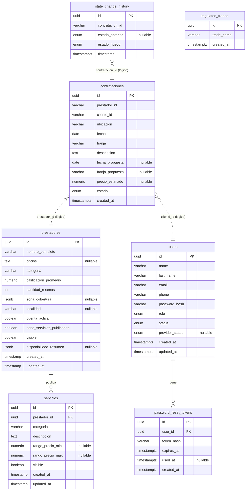

# Diagrama Entidad-Relación (DER)

Modelo de datos de Snack Overflow, generado a partir del esquema vivo de la base
PostgreSQL (`snack_overflow`). El esquema lo crea TypeORM con `synchronize: true`
(no hay migraciones), por lo que esta es la fuente de verdad real.

## Relaciones

- **2 FKs declaradas** (constraint real en la base):
  - `servicios.prestador_id → prestadores.id`
  - `password_reset_tokens.user_id → users.id`
- **3 relaciones lógicas** (IDs `varchar`, sin constraint — TypeORM no las
  enforcea, se resuelven en la capa de aplicación). Van punteadas en el diagrama:
  - `contrataciones.prestador_id → prestadores.id`
  - `contrataciones.cliente_id → users.id`
  - `state_change_history.contratacion_id → contrataciones.id`

## Diagrama

## Notas

- `regulated_trades` no tiene FK — es catálogo de oficios regulados, se valida por
  `trade_name` en el registro (UC01), no por relación.
- `prestadores` ≠ `users`: son tablas separadas, sin FK. `prestadores` es el modelo
  de lectura del catálogo (proyección de búsqueda), no la entidad de autenticación.
  Por eso `contrataciones.prestador_id` apunta lógicamente a ambas según el contexto.
- Enums Postgres (`USER-DEFINED`): `role`, `status`, `provider_status`, `estado`,
  `estado_anterior` / `estado_nuevo`.
</content>
</invoke>
