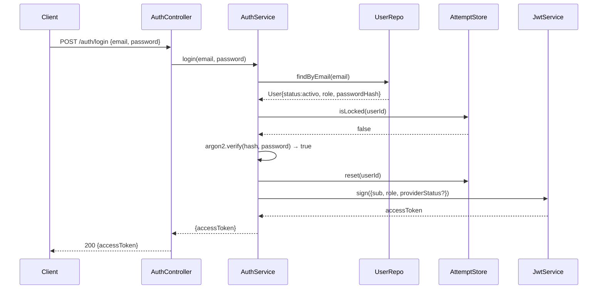
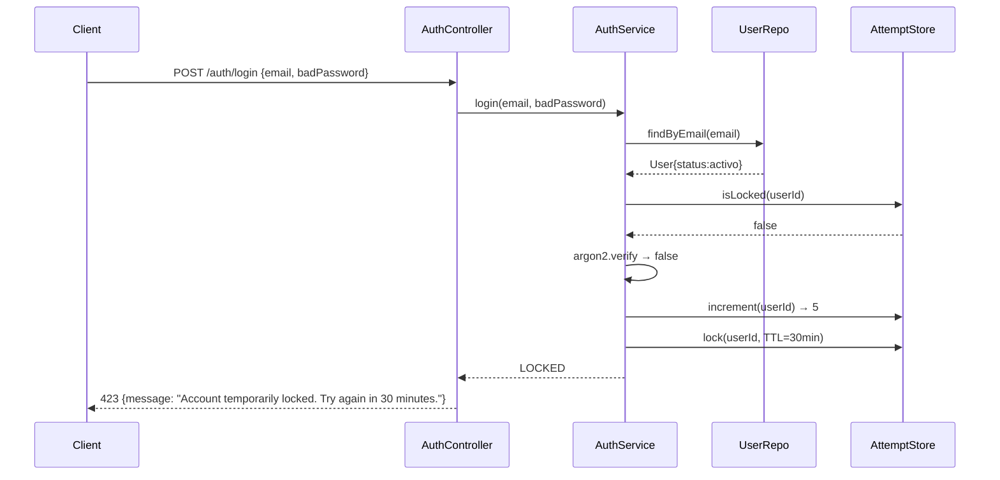

# UC02 — Autenticarse: Technical Design

**Status:** Draft — Pending HITL review  
**Spec:** `openspec/changes/uc02-autenticarse/spec.md`  
**ADRs applied:** ADR-001 (monolito modular), ADR-002 (Port+Adapter), ADR-003 (Repository+PostgreSQL+Redis), ADR-004 (TypeScript/NestJS 11), ADR-006 (OCL → Jest assertions), ADR-007 (TypeORM)

---

## 1. Module Structure

The feature lives in a single NestJS feature module called `auth` (bounded context: authentication and session issuance). It is a **domain module** — it owns the User aggregate for auth purposes and delegates everything external behind ports.

```
server/src/
├── app.module.ts                          # registers AuthModule
├── auth/
│   ├── auth.module.ts                     # wires all providers; imports JwtModule, PassportModule
│   ├── auth.controller.ts                 # HTTP facade — routes, DTOs in/out, guards
│   │
│   ├── application/
│   │   └── auth.service.ts                # orchestrates all use-case flows (login, recover, reset)
│   │
│   ├── domain/
│   │   ├── user.entity.ts                 # User aggregate root (TypeORM Entity)
│   │   ├── password-reset-token.entity.ts # PasswordResetToken entity
│   │   ├── user-role.enum.ts              # 'cliente' | 'prestador' | 'administrador'
│   │   ├── user-status.enum.ts            # 'activo' | 'suspendido'
│   │   └── provider-status.enum.ts        # 'habilitado' | 'pendiente_habilitacion'
│   │
│   ├── ports/
│   │   ├── user.repository.port.ts        # IUserRepository interface
│   │   ├── attempt-store.port.ts          # IAttemptStore interface (Redis-backed)
│   │   ├── token-store.port.ts            # ITokenStore interface (password-reset tokens)
│   │   └── email-notifier.port.ts         # IEmailNotifier interface (RF-1.6, ADR-002)
│   │
│   ├── adapters/
│   │   ├── typeorm-user.repository.ts     # implements IUserRepository via TypeORM
│   │   ├── redis-attempt-store.ts         # implements IAttemptStore via ioredis
│   │   ├── typeorm-token-store.ts         # implements ITokenStore via TypeORM
│   │   └── nodemailer-email-notifier.ts   # implements IEmailNotifier via Nodemailer (swappable)
│   │
│   ├── strategies/
│   │   └── jwt.strategy.ts                # PassportStrategy(Strategy) — validates Bearer JWT
│   │
│   ├── guards/
│   │   └── jwt-auth.guard.ts              # extends AuthGuard('jwt') — used by downstream modules
│   │
│   └── dto/
│       ├── login.dto.ts                   # { email: string; password: string }
│       ├── login-response.dto.ts          # { accessToken: string }
│       ├── forgot-password.dto.ts         # { email: string }
│       ├── reset-password.dto.ts          # { token: string; newPassword: string }
│       └── generic-message.dto.ts         # { message: string }
```

---

## 2. Data Model

### 2.1 PostgreSQL — `users` table

| Column | Type | Notes |
|--------|------|-------|
| `id` | `uuid` PK | `DEFAULT gen_random_uuid()` |
| `email` | `varchar(255)` UNIQUE NOT NULL | lowercased on write |
| `password_hash` | `varchar(255)` NOT NULL | Argon2id output |
| `role` | `enum('cliente','prestador','administrador')` NOT NULL | |
| `status` | `enum('activo','suspendido')` NOT NULL DEFAULT `'activo'` | RN-AUTH-01 |
| `provider_status` | `enum('habilitado','pendiente_habilitacion')` NULLABLE | NULL when role ≠ prestador |
| `created_at` | `timestamptz` NOT NULL DEFAULT NOW() | |
| `updated_at` | `timestamptz` NOT NULL | auto-updated |

**Why no attempt counter column?** The failed-attempt counter and lockout expiry are volatile, write-intensive state that resets on every login. Storing them in PostgreSQL would cause row-level contention under concurrent login attempts and requires a separate UPDATE round-trip per attempt. Redis with a `INCR` + `EXPIRE` pattern is atomic and expires entries automatically — no cron job or background sweep needed. This directly implements RN-AUTH-04 (auto-expiration at 30 min).

### 2.2 PostgreSQL — `password_reset_tokens` table

| Column | Type | Notes |
|--------|------|-------|
| `id` | `uuid` PK | |
| `user_id` | `uuid` FK → `users.id` NOT NULL | |
| `token_hash` | `varchar(255)` NOT NULL | SHA-256 of the raw token sent by email |
| `expires_at` | `timestamptz` NOT NULL | `NOW() + interval '30 minutes'` |
| `used_at` | `timestamptz` NULLABLE | NULL = not yet consumed |
| `created_at` | `timestamptz` NOT NULL DEFAULT NOW() | |

The raw token (UUID v4 or 32-byte random hex) is sent in the email link; only its SHA-256 hash is persisted (RNF-S.2). Lookup is by hash comparison. `used_at` IS NOT NULL → token consumed (ESC-07).

### 2.3 Redis key schema

| Key pattern | Value | TTL | Purpose |
|------------|-------|-----|---------|
| `auth:attempts:{userId}` | integer (INCR) | 30 min (set on 5th failure) | Failed-attempt counter (RN-AUTH-03/04) |
| `auth:locked:{userId}` | `"1"` | 30 min | Lockout sentinel — presence = locked (ESC-04/09) |
| `auth:pwreset_count:{userId}` | integer (INCR) | 1 hour (rolling) | Rate limit: max 3 recovery requests/hour (RN-AUTH-05) |

**Lock mechanics:** On the 5th consecutive failure, the service sets `auth:locked:{userId}` with TTL 30 min. On login, the service checks this key first (after checking suspension). On expiry, Redis deletes the key automatically — no admin action needed (PA-01 resolved). On successful login, the service DELetes `auth:attempts:{userId}` and `auth:locked:{userId}` (RN-AUTH-03/ESC-09/ESC-10).

---

## 3. Domain Logic

### 3.1 Login validation machine (ordered)

```
AuthService::login(email, password):
  1. user = userRepo.findByEmail(email)
     if user is null → increment attempt counter (to avoid timing oracle) → return INVALID_CREDENTIALS
  2. if user.status === 'suspendido' → return SUSPENDED  [RN-AUTH-01, ESC-05, PA-06]
  3. if attemptStore.isLocked(user.id) → return LOCKED    [RN-AUTH-04, ESC-04]
  4. valid = argon2.verify(user.passwordHash, password)
     if !valid:
       count = attemptStore.increment(user.id)
       if count >= 5 → attemptStore.lock(user.id, 30min) → return LOCKED
       return INVALID_CREDENTIALS                          [RN-AUTH-02, ESC-03/04]
  5. attemptStore.reset(user.id)                           [RN-AUTH-03, ESC-10]
  6. claims = { sub: user.id, role: user.role,
                ...(user.role==='prestador' && { providerStatus: user.providerStatus }) }
  7. token = jwtService.sign(claims, { expiresIn: '2h' })  [RN-AUTH-06]
  8. return { accessToken: token }                         [ESC-01/02/09/10]
```

**Note on suspension check order:** Step 2 checks suspension before validating password (PA-06). Because step 1 always increments on unknown email, no timing difference leaks whether email exists (RNF-S.4 / RN-AUTH-02).

### 3.2 Password recovery flow

```
AuthService::requestPasswordReset(email):
  1. user = userRepo.findByEmail(email)
     if user is null → return OK (no-op, same response) [ESC-08, RNF-S.4]
  2. count = resetRateStore.count(user.id)
     if count >= 3 → return OK (silent drop)            [RN-AUTH-05, PA-07]
  3. rawToken = crypto.randomBytes(32).toString('hex')
  4. hash = sha256(rawToken)
  5. tokenStore.save({ userId, hash, expiresAt: now+30min })
  6. resetRateStore.increment(user.id, ttl=1h)
  7. emailNotifier.sendPasswordReset(user.email, rawToken) [ADR-002, RF-1.6]
  8. return OK

AuthService::resetPassword(rawToken, newPassword):
  1. hash = sha256(rawToken)
  2. record = tokenStore.findByHash(hash)
     if not found → return INVALID_TOKEN               [ESC-07]
  3. if record.expiresAt < now → return EXPIRED_TOKEN   [ESC-07]
  4. if record.usedAt is not null → return INVALID_TOKEN [ESC-07]
  5. newHash = argon2.hash(newPassword)                  [RN-AUTH-08]
  6. userRepo.updatePasswordHash(record.userId, newHash)
  7. tokenStore.markUsed(record.id)
  8. return OK                                           [ESC-06]
```

### 3.3 Sequence diagrams

#### ESC-01: Successful login



#### ESC-04: Account locked on 5th failure



---

## 4. Ports and Adapters

### 4.1 `IUserRepository` — `ports/user.repository.port.ts`

```typescript
interface IUserRepository {
  findByEmail(email: string): Promise<User | null>;
  findById(id: string): Promise<User | null>;
  updatePasswordHash(userId: string, newHash: string): Promise<void>;
}
```

**Adapter:** `typeorm-user.repository.ts` — TypeORM `Repository<User>`.

### 4.2 `IAttemptStore` — `ports/attempt-store.port.ts`

```typescript
interface IAttemptStore {
  increment(userId: string): Promise<number>;   // returns new count
  isLocked(userId: string): Promise<boolean>;
  lock(userId: string, ttlSeconds: number): Promise<void>;
  reset(userId: string): Promise<void>;         // DEL both keys
}
```

**Adapter:** `redis-attempt-store.ts` — ioredis `INCR` / `SET EX` / `DEL`.

### 4.3 `ITokenStore` — `ports/token-store.port.ts`

```typescript
interface ITokenStore {
  save(record: { userId: string; tokenHash: string; expiresAt: Date }): Promise<void>;
  findByHash(tokenHash: string): Promise<PasswordResetToken | null>;
  markUsed(tokenId: string): Promise<void>;
  countWithinHour(userId: string): Promise<number>; // for rate limit check
}
```

**Adapter:** `typeorm-token-store.ts` — TypeORM `Repository<PasswordResetToken>`.

### 4.4 `IEmailNotifier` — `ports/email-notifier.port.ts` (ADR-002)

```typescript
interface IEmailNotifier {
  sendPasswordReset(toEmail: string, rawToken: string): Promise<void>;
}
```

**Adapter:** `nodemailer-email-notifier.ts` — wraps Nodemailer with SMTP config from env. The business logic in `AuthService` **only calls the port interface**, never Nodemailer directly. Swapping to SendGrid, AWS SES, or a stub for tests requires zero changes to `AuthService`.

**Injection token:** `EMAIL_NOTIFIER` (string token) — provided in `AuthModule` with `useClass: NodemailerEmailNotifier`. Tests inject a mock implementing the same interface.

---

## 5. REST Endpoints

All routes are prefixed `/auth` and registered in `AuthController`.

### 5.1 Endpoint table

| Method | Route | Request body | Success | Error | Scenarios |
|--------|-------|-------------|---------|-------|-----------|
| `POST` | `/auth/login` | `LoginDto` | `200 LoginResponseDto` | `401`, `403`, `423` | ESC-01..05, 09, 10 |
| `POST` | `/auth/forgot-password` | `ForgotPasswordDto` | `200 GenericMessageDto` | — (always 200) | ESC-06, ESC-08 |
| `POST` | `/auth/reset-password` | `ResetPasswordDto` | `200 GenericMessageDto` | `400`, `410` | ESC-06, ESC-07 |

### 5.2 HTTP status map

| Code | Meaning in UC02 | Scenario |
|------|----------------|----------|
| `200` | Login OK / recovery initiated / password updated | ESC-01, 02, 06, 08, 09, 10 |
| `400` | Reset token invalid or malformed | ESC-07 (token not found) |
| `401` | Credentials invalid (generic, never reveals which field) | ESC-03 |
| `403` | Account suspended | ESC-05 |
| `410` | Reset token expired or already used | ESC-07 (found but expired/used) |
| `423` | Account temporarily locked | ESC-04 |

### 5.3 Response shapes

**POST /auth/login — 200**
```json
{ "accessToken": "<jwt>" }
```

**POST /auth/login — 401**
```json
{ "message": "Invalid credentials." }
```

**POST /auth/login — 403**
```json
{ "message": "Account suspended. Contact support." }
```

**POST /auth/login — 423**
```json
{ "message": "Account temporarily locked. Try again in 30 minutes." }
```

**POST /auth/forgot-password — 200** (always, regardless of email existence)
```json
{ "message": "If that email is registered, a recovery link has been sent." }
```

**POST /auth/reset-password — 200**
```json
{ "message": "Password updated successfully." }
```

**POST /auth/reset-password — 400/410**
```json
{ "message": "Recovery link is invalid or has expired. Please request a new one." }
```

### 5.4 JWT claims

```json
{
  "sub": "uuid",
  "role": "cliente | prestador | administrador",
  "providerStatus": "habilitado | pendiente_habilitacion",  // only when role=prestador
  "iat": 1234567890,
  "exp": 1234567890
}
```

`providerStatus` is omitted entirely for non-prestador roles (RNF-S.1 minimum privilege). Downstream guards check `role` and, for prestador endpoints, `providerStatus !== 'pendiente_habilitacion'` (RNF-S.3 / RN-AUTH-07).

---

## 6. OCL Contracts → Testable Assertions

### 6.1 `AuthService::login()`

**Pre-conditions:**
- `email` is a non-empty string in valid email format
- `password` is a non-empty string

**Post-conditions:**
- If result is `accessToken`:  
  - JWT decodes to `{ sub: user.id, role: user.role }` (and `providerStatus` if prestador)  
  - `attemptStore.isLocked(user.id)` returns `false`  
  - `attemptStore.increment` was NOT called
- If result is `INVALID_CREDENTIALS`:  
  - No token is returned  
  - `attemptStore` counter for user incremented by 1
- If result is `LOCKED` (on 5th failure):  
  - No token is returned  
  - `attemptStore.isLocked(user.id)` returns `true`
- If result is `SUSPENDED`:  
  - No token is returned  
  - `attemptStore` was NOT touched

### 6.2 `AuthService::resetPassword()`

**Pre-conditions:**
- `rawToken` is a non-empty string
- `newPassword` is a non-empty string

**Post-conditions:**
- If result is `OK`:  
  - `userRepo.updatePasswordHash` was called with a valid Argon2id hash  
  - `tokenStore.markUsed` was called with the correct token ID  
  - Old password hash no longer validates against new password
- If result is `INVALID_TOKEN` or `EXPIRED_TOKEN`:  
  - `userRepo.updatePasswordHash` was NOT called  
  - `tokenStore.markUsed` was NOT called

### 6.3 Scenario → test mapping

| ESC | What is tested | Type |
|-----|---------------|------|
| ESC-01 | `login()` with valid user → 200 + valid JWT claims | Unit + API (Supertest) |
| ESC-02 | `login()` with prestador `pendiente_habilitacion` → 200 + `providerStatus` in JWT | Unit + API |
| ESC-03 | `login()` with bad password, counter N<4 → 401, counter incremented | Unit + API |
| ESC-04 | `login()` with bad password on 5th attempt → 423, lock set | Unit + API |
| ESC-05 | `login()` with suspended user → 403, no credential check | Unit + API |
| ESC-06 | `requestPasswordReset()` + `resetPassword()` with valid token → 200 + hash updated | Unit + API |
| ESC-07 | `resetPassword()` with expired/used token → 400/410, no DB write | Unit + API |
| ESC-08 | `requestPasswordReset()` with unknown email → 200, no email sent, same response shape | Unit + API |
| ESC-09 | After lock TTL expiry → `login()` with valid creds succeeds → 200 | Integration (Redis TTL) |
| ESC-10 | `login()` success after N<5 failures → counter reset, 200 | Unit + API |

---

## 7. Dependencies to Add

| Package | Env | Justification |
|---------|-----|--------------|
| `@nestjs/jwt` | prod | NestJS wrapper for JWT signing/verification |
| `@nestjs/passport` | prod | Passport integration for NestJS guards/strategies |
| `passport` | prod | Core Passport.js library (peer dep of `@nestjs/passport`) |
| `passport-jwt` | prod | JWT Bearer strategy for Passport |
| `@types/passport-jwt` | dev | TypeScript types for `passport-jwt` |
| `argon2` | prod | Argon2id hashing (RN-AUTH-08 / PA-05); native bindings, faster than pure-JS bcrypt |
| `typeorm` | prod | ORM for PostgreSQL; repository pattern maps to ADR-003; TypeORM's DataMapper is port-friendly |
| `@nestjs/typeorm` | prod | NestJS module integration for TypeORM |
| `pg` | prod | PostgreSQL driver for TypeORM |
| `@types/pg` | dev | TypeScript types for `pg` |
| `ioredis` | prod | Redis client for attempt store / rate limiting; supports TTL natively |
| `nodemailer` | prod | SMTP email adapter implementing `IEmailNotifier` port (RF-1.6) |
| `@types/nodemailer` | dev | TypeScript types for Nodemailer |
| `class-validator` | prod | DTO validation via decorators (`@IsEmail`, `@IsNotEmpty`) |
| `class-transformer` | prod | DTO transformation pipeline (`ValidationPipe` in NestJS) |

---

## 8. Security Design

### RNF-S.1 — Minimum privilege in JWT claims

JWT contains only `sub`, `role`, `providerStatus` (when applicable), `iat`, `exp`. No PII (name, email, phone). Downstream guards read `role` and `providerStatus` from the JWT; they never fetch user data just to authorize a request.

### RNF-S.2 — Password confidentiality

- Passwords hashed with Argon2id (memory-hard, resistant to GPU/ASIC attacks).
- Only the hash is persisted; the raw password never leaves `AuthService::login()`.
- Password reset tokens: only SHA-256 hash stored in DB; raw token sent in email only.
- TLS enforced at infrastructure level (load balancer / reverse proxy); `AuthModule` does not configure TLS itself.

### RNF-S.4 — Ley 25.326 / no-enumeration

- `POST /auth/login` 401 response is identical whether the email doesn't exist or the password is wrong (RN-AUTH-02).
- `POST /auth/forgot-password` always returns 200 with the same message body (ESC-08).
- Logs must NOT contain email addresses in access log lines. The application layer logs only `userId` (after successful lookup) and event type (`LOGIN_FAILED`, `ACCOUNT_LOCKED`, etc.). Email is never written to application logs.
- The attempt counter increment on unknown email (section 3.1, step 1) ensures no timing difference leaks email existence.

### RNF-S.3 — Prestador pending validation

`providerStatus: 'pendiente_habilitacion'` is emitted in the JWT. Enforcement is NOT done in `AuthModule` — it is the responsibility of each downstream feature module's guard/decorator (UC18 boundary). `AuthModule` documents and exports the `JwtAuthGuard` that downstream modules attach.

---

## 9. Design Decisions and HITL Checkpoints

| # | Decision | Rationale | HITL action required |
|---|----------|-----------|---------------------|
| D-01 | Failed-attempt counter in Redis, NOT in a PostgreSQL column | Atomic `INCR`, native TTL-based auto-expiry, no row contention; aligns with RN-AUTH-04 auto-unlock. | Confirm Redis is available in the production environment (docker-compose / cloud). |
| D-02 | Reset token: raw token via email, SHA-256 hash in DB | Never store the secret that grants password-change capability in the DB. Lookup by hash. | None — standard practice. |
| D-03 | No logout / no token blocklist | PA-02 resolved: JWT expiry only. Consequence: a stolen token is valid until `exp`. Acceptable for TPI scope. | Reconfirm scope if any stakeholder adds logout requirement. |
| D-04 | `IEmailNotifier` port with Nodemailer adapter | ADR-002 compliance. Tests inject a mock; production uses Nodemailer SMTP. Config via env vars (`SMTP_HOST`, `SMTP_PORT`, `SMTP_USER`, `SMTP_PASS`, `SMTP_FROM`). | Confirm SMTP credentials / provider for production and staging. |
| D-05 | TypeORM as ORM | DataMapper pattern is compatible with Repository port. ✅ **Confirmed HITL — formalized as ADR-007 (project-wide ORM decision).** | Resolved. |
| D-06 | JWT expiry set to 2 hours | Not specified in spec. ✅ **Confirmed HITL: 2 hours.** | Resolved. |
| D-07 | Rate limit on `forgot-password` is silent (returns 200 even when rate-limited) | Prevents enumeration of whether an account exists AND whether it has been rate-limited. Same message regardless. | Confirm this silent-drop is acceptable UX for the client. |
| D-08 | `providerStatus` claim omitted entirely for non-prestador roles | Minimum privilege (RNF-S.1). Downstream guards should treat absence of claim as non-prestador. | Downstream module owners must handle absent `providerStatus` claim without throwing. |
| D-09 | `password_reset_tokens` in PostgreSQL (not Redis) | Requires ACID durability: concurrent `markUsed` + `updatePasswordHash` must be atomic. Redis TTL alone doesn't give durable audit trail. | None — preferred approach. |
| D-10 | Suspension check before credential validation (PA-06) | Prevents information leak: attacker cannot distinguish "wrong password" from "account suspended AND wrong password". | Already resolved HITL; confirmed in spec. |
